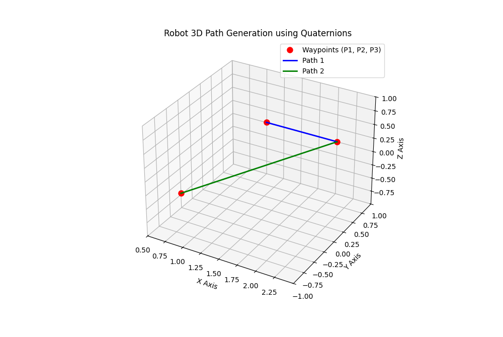

# 🧭 3D Robotic Kinematics & Spatial Math with Quaternions

This repository demonstrates the mathematical foundation and Python implementation of 3D spatial kinematics for robotic systems. It focuses on coordinate transformations and path generation using **Quaternions** to represent rotations in 3D space.

### 🧠 Core Concepts & Mathematical Foundation
In complex robotic systems (like 6-DOF robotic arms or UAVs), representing rotations with standard Euler angles often leads to the **Gimbal Lock** problem (loss of a degree of freedom). To ensure continuous and stable mathematical representation, this project utilizes **Quaternions**.

The implementation features:
* [cite_start]**Custom Quaternion Mathematics:** A custom Python implementation for quaternion multiplication ($q \otimes p \otimes q^*$) handling the real (scalar) and imaginary (vector) parts[cite: 824, 825].
* [cite_start]**Coordinate Frame Transformations:** Mapping 3D waypoints from a camera's local coordinate frame to the robot's global base frame using rigid body transformations (rotation + translation)[cite: 821, 827].
* [cite_start]**3D Path Generation:** Connecting the transformed waypoints to generate a continuous path in 3D space[cite: 828].

### 📊 3D Path Visualization
The transformed waypoints and the resulting continuous path of the robot are plotted in a 3D coordinate system.

### 💻 Code Structure
* `quat_mult(a, b)`: Core logic for multiplying two quaternions without relying on external transformation libraries.
* [cite_start]**Rotation Definition:** Creates the rotational quaternion ($q$) and its conjugate ($q^*$) for a $120^\circ$ rotation around the Y-axis[cite: 823].
* **Transformation Loop:** Iterates through local points, applying the rotation and translation sequentially to output global coordinates.

### 🚀 How to Run
Ensure you have `numpy` and `matplotlib` installed. Run the `robot_kinematics.py` script. A 3D interactive plot will open, allowing you to rotate and inspect the robot's path from any angle.
